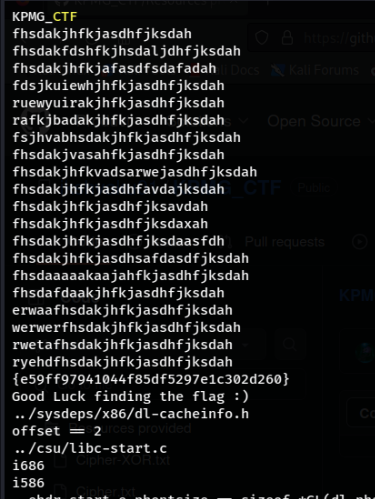

# Unveiling the Hidden Message

The objective of this challenge is to reverse engineer a given binary executable file and extract flag embedded within the program. Payload binary executable:

[Payload](re2_payload)

**Points - 100**

## Procedure

Firstly, we will gather more info about the binary Payload, let's start with **file** command:

```Shell
file Payload
```

Output:

```Shell
payload: ELF 32-bit LSB executable, Intel 80386, version 1 (GNU/Linux), statically linked, BuildID[sha1]=5ba37dceb6b6b07d34d50fba6e71288dc8ae4ee5, for GNU/Linux 3.2.0, with debug_info, not stripped
```

Since the payload is a linux executable let's execute it:

```Shell
chmod +x payload
./payload
```

Output:

```plaintext
Good Luck finding the flag :) 
```

Now let's try to find the flag by performing static analysis. For starters, lets do a **Strings** search:

```Shell
strings payload | less
```

The above command performs a search of every strings which is larger than 4 chars, we are piping the output to less which helps us perform basic operations such as search. Upon executing the command we can do a basic search :

```Shell
/CTF
```

which gives us :



Since we know the flag is of the format - KPMG_CTF{ ... }, we can already see the flag.

#### Flag : KPMG_CTF{e59ff97941044f85df5297e1c302d260}
